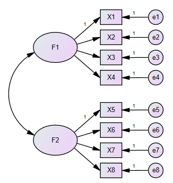

```{r setup, include = FALSE}
library(knitr)
library(tidyverse)
library(xaringanExtra)
library(pagedown)
library(tinytex)
library(mice)
library(psy)
library(car)
library(MVN)
xaringanExtra::use_panelset()
htmltools::tagList(
  xaringanExtra::use_clipboard(
    button_text = "<i class=\"fa fa-clipboard\"></i>",
    success_text = "<i class=\"fa fa-check\" style=\"color: #90BE6D\"></i>",
  ),
  rmarkdown::html_dependency_font_awesome()
)

# set default options
opts_chunk$set(dpi = 300)

```

class: title-slide, left, bottom

# `r rmarkdown::metadata$title`
----
## **`r rmarkdown::metadata$subtitle`**
### `r rmarkdown::metadata$author`
### `r rmarkdown::metadata$date`

---

# 목차
----

1. 데이터 준비

1. 데이터의 측정학적 적절성

    * 표본크기
    * 다변량 정규성
    * 이상치
    * 다중공선성
    * 신뢰도
    * 결측치

1. GEPS 예제

---
class: inverse,middle,center
# 데이터 준비

---

# 데이터 준비
____

## 라이브러리 구동

```{r echo=T, message=F, klippy, results='hide'}
pkg_list <- c(
  "haven","tidyverse","modelsummary","lavaan",
  "lavaanPlot","knitr","epiDisplay","tinytex",
  "showtext","stargazer","tibble","magrittr",
  "semPlot","semTools"
  )

lapply(pkg_list, require, character.only = T)
```

---

# 데이터 준비
____

## 파일 불러오기

* read_csv()
```{r, echo=T, comment=""}
e4_s <- read_sav("../DATA/1차년도_초등학교/1차년도_학생(초).sav")

```
---

# 데이터 준비
____

## ID 변수 확인

* names() 
```{r, echo=T, comment="",collapse=TRUE}
names(e4_s)[1:5]
e4_s$STUID[1:5]
```

---

# 데이터 준비
----

## 케이스 결측치 확인
.pull-left[
* 케이스 결측치 확인
```{r}
complete.cases(e4_s[,1:20])[1:50]
```
]

.pull-right[
* 케이스 결측치 행 확인
```{r}
which(!complete.cases(e4_s[,1:20]))
```
]
---
# 데이터 준비
----

## 변수별 결측치 확인
.pull-left[
* 변수별 결측치 확인
```{r}
is.na(e4_s)[1:5,11:15]
```
]

.pull-right[
* 변수별 결측치수
```{r}
colSums(is.na(e4_s))[11:15]
```
]
---

# 데이터 준비
----

## 결측치 비율 계산하기

```{r}
e4_s_missing_ratio <- as.data.frame((colSums(is.na(e4_s))/length(e4_s$STUID))*100)
e4_s_missing_ratio[1:50,]
```

---

# 데이터 준비
----

## 결측치 제거하기

* 행 제거(list-wise deletion)
* na.omit()
```{r}
e4_s_nomiss <- na.omit(e4_s[,1:20]); glimpse(e4_s_nomiss)

```

---

# 데이터 준비
----

## 역산문항 처리하기

* 성장신념 문항 / 5점 리커트 척도인 경우
```{r}
e4_s <- e4_s %>% mutate(
  Y1E_ST21_1R=6-Y1E_ST21_1,
  Y1E_ST21_2R=6-Y1E_ST21_2,
  Y1E_ST21_3R=6-Y1E_ST21_3
)
```

---

# 데이터 준비
----

## 더미변수 만들기

* 성별인 경우
```{r}
e4_s <- e4_s %>% mutate(
  female=ifelse(Y1E_ST1_1==2,1,0)
)
e4_s$female[1:10]
```

---
class: inverse, middle, center

# 데이터의 측정학적 적절성 검토

---

# 표본 크기
----

* 구조방정식에서 주로 사용하는 추정방법이 **최대우도(ML)**인데 <br>이는 **다변량 정규성**을 만족시키는 큰 표본에 기반한 방법임

* 정규성을 만족하는 경우 작은 표본도 큰 문제를 일으키진 않지만, <br>**충분한 표본**을 확보하지 못하면 표준오차의 정확성으로 인해 결과를 믿을 수 없게 됨

---

# 표본 크기
----

## 표본 크기에 대한 학자들의 다양한 의견

.pull-left[
  * 사례수
  
    + Anderson & Gerbing(1988): 150(CFA의 경우)
    + Holbert & Stephenson(2002): 150
    + Chou & Bentler(1995): 200
    + Hoyle & Kenny(1999): 100, <br>가능하면 200<br>(잠재변수가 있는 매개모형의 경우)
]
.pull-right[
  * *N*:*q*(*N*=표본크기, *q*=추정모수의 개수)
  
    + Jackson(2001, 2003): <br>요인분석의 경우 20:1
    + Kline(2011): 10:1, 가능하면 20:1
    + Tanaka(1987): 20:1
    + Bentler & Chou(1987): 5:1
]    
---

# 표본 크기
----

## 표본 크기 계산 방법

### MacCallum, Browne, & Sugawara(1996) 방법

* 영가설의 RMSEA와 대립가설의 RMSEA의 차이를 이용하는 방법

* 주어진 검정력과 모형 적합도에서 표본크기를 추정할 수 있는 방법

* 자유도가 크지 않은 경우는 사용을 하지 않는 게 좋음

  + Kenny, Kaniskan, & McCoach(2014):<br> 자유도가 낮은 경우 RMSEA 자체를 계산하지 말아야 함

* 모형의 종류와 관계없이 사용가능함  

---

# 표본 크기
----

## 표본 크기 계산 방법

### MacCallum, Browne, & Sugawara(1996) 방법

.pull-left[

* model1




]

.pull-right[

* model1의 자유도: 19<br>

  + 정보의 개수(36)-추정해야 할 모수(17)

      + 잠재변수의 분산 및 공분산: 3
      + 요인부하량: 6
      + 측정오차 분산: 8

]

---

# 표본 크기
----

## 표본 크기 계산 방법

### MacCallum, Browne, & Sugawara(1996) 방법

* 유의수준 .05, 검정력 .8, 자유도 19를 만족시키는 표본크기 추정

* [Preacher & Coffman(2006)의 사이트](http://www.quantpsy.org/rmsea/rmsea.htm)

---

# 다변량 정규성
----

* 최대우도 추정은 연속형 종속변수들의 다변량 정규성을 가정함

* 다변량 정규성: 각각의 변수가 정규분포를 따르며,<br> 두 변수의 결합분포가 이변량 정규분포를 따름을 의미함

* MVN 패키지를 이용해 다변량 정규성 검정을 실행할 수 있음
.pull-left[
정규성 검정  | 그래프
------------- | ------------- 
Mardia 방법  |Q-Q plot      
  Henze-Zirkler 방법|perspective plot
  Royston 방법|contour plot
]

---

# 다변량 정규성
----
  
* 다변량 정규성 검정은 표본크기가 크면 약간의 위반에 대해서도 <br> 정규성 가정을 기각하는 단점이 있음
  
* Kline(2011): 각 변수의 단변량 정규성을 조사하는 것만으로 다변량 정규성을 확인할 수 있음  

  + 단변량 정규성 검정 방법
  
      + Kolmogorov-Smirnov 검정
      + Shapiro-Wilk 검정
      + Q-Q plot
      
  + 하지만 단변량 정규성 검정 방법 또한 표본크기에 민감함
      
* 여러 가지 이유와 한계점으로 인해 구조방정식에서 단변량 정규성을 확인하는 방법은 <br> 주로 **왜도와 첨도**를 이용함      


---

# 다변량 정규성
----
  
* Kline(2011)
  + 왜도의 절대값: 3
  + 첨도의 절대값: 10

* Curran, West, & Finch(1997)
  + 왜도의 절대값: 2
  + 첨도의 절대값: 7
  
* 다변량 정규성을 만족하지 않았을 경우
  + 문항묶음
  + 척도 변환
      + 로그 변환

---

# 이상치(outlier)
----

## 이상치

* 하나 또는 여러 변수에서 매우 큰 값이나 작은 값을 의미함

* 모형 분석 전에 찾아서 제거하는 것이 중요하나 <br>최종적인 결정은 연구자의 경험과 논리적인 판단으로 결정해야 함

* 구조방정식에서 이상치를 다루는 방법은 두 가지임

  + 단변량 이상치: 개별 변수마다 이상치를 결정하고 제거하는 방법
  + 다변량 이상치: 여러 변수를 한꺼번에 고려해 이상치를 결정하는 방법

---

# 이상치(outlier)
----

## 이상치

* 다변량 이상치를 판단하는 대표적인 방법은 Mahalanobis의 거리를 이용하는 방법

* Mahalanobis의 거리: 일반적인 차원 상에서 자료의 중심과 한 점의 통계적인 거리를 <br>나타내는 지수

* Mahalanobis의 거리는 다차원 상에서 한 점과 자료의 중심 사이의 거리를 <br>표준편차 단위로 나타내는 수치

* $d^2$ 검정을 이용해 이상치를 찾아낼 수 있음

  + Kline(2011): $d^2$ 검정이 이상치의 영향에 상당히 민감하므로 <br>보수적으로 접근해 유의수준 .001에서 검정하기를 제안함 
  
---
# 다중공선성
----

* 공선성(collinearity)은 두 변수 간에 상관이 매우 높을 때 발생하게 되는 문제임

* 다중공선성(multicollinearity)은 여러 변수 간 상관이 매우 높을 때 발생하게 되는 문제임

* 다중공선성이 존재하면<br> 추정치 검정에 필요한 표준오차 값이 정확하게 추정되지 않는다는 문제점이 생김

* 다중공선성 확인
  + 분산팽창지수(variance inflation factor, VIF): 10 이상
  + 다중상관제곱( $R^2$ ): 0.9 이상
  + 공차(tolerance): 0.1 이하

---

# 다중공선성
----

* 다중공선성이 존재하는 경우 해결 방법

  + 높은 VIF 변수 제거
  + 변수 합치기

---

# 신뢰도
----

* 신뢰도는 검사에 대한 것이 아니라 점수에 대한 것임

* 신뢰도를 보고할 때는<br> 이 검사를 어느 집단에 실시하였더니 높은 신뢰도를 얻었다고 하는 것이 바람직함

* 신뢰도를 추정하는 방법

  + 평행검사(parallel forms)
  + 검사 재검사(test-retest)
  + 반분(split-half)
  + 내적일치도(internal consistency)
  
---

# 신뢰도
----

## Cronbach's alpha 

* 실제 연구에서 가장 많이 사용되는 신뢰도

.pull-left[
* Kline(2000)

  + 훌륭한(excellent): .9 이상
  + 좋은(good): .7~.9
  + 받아들일 수 있는(acceptable): .6~.7
  + 나쁜(poor): .5~.6
  + 받아들일 수 없는(unacceptable):<br> .5 미만
]

.pull-right[
* Nunnally(1994)

  + Early stage of research: .7 이상
  + Applied research: .8 이상
  + When making important decisions: .95(최소 .9) 이상
]

---

# 신뢰도
----

## Cronbach's alpha 

* 구조방정식 관점에서는 Nunnally의 제안이 더 합리적임. <br> 그 이유는 너무 비슷한 문항을 사용하면 측정오차들 간의 높은 상관으로 인해 <br>모형의 적합도가 오히려 떨어지는 경향이 있음(Bandalos, 2002)

---

# 결측치
----

## 결측치 발생 원인

* 답변 거부
* 시간 부족
* 연구 참가자의 이탈 현상(종단연구 등)
* 연구 설계 자체의 문제

## 결측치 패턴 분석

* Rubin(1976, 1987)
  + MCAR(missing completely at random, 완전 무선 결측)
  + MAR(missing at random, 무선 결측)
  + MNAR(missing not at random, 비무선 결측)

---

# 결측치
----
## MCAR

* 결측치의 패턴이 어떤 변수와도 관련이 없을 때

  + Pr(y is missing|x,y,z)=Pr(y is missing)

---

# 결측치
----
## MAR

* 결측치의 패턴이 자기 자신과는 관련이 없지만 다른 변수와는 관련이 있을 때

  + Pr(y is missing|x,y,z)=Pr(y is missing|x,z)

---

# 결측치
----
## MNAR

* 결측치의 패턴이 자기 자신과도 관련이 있을 때

  + Pr(y is missing|x,y,z)=Pr(y is missing|x,y,z)
<br>
<br>
<br>


* **구조방정식 모형에서 MCAR나 MAR의 결측치 패턴은 무시할 수 있음**  

---

# 결측치
----

## 결측치 처리 방법

* 삭제(deletion)

* 대체(imputation)

---

# 결측치
----

## 삭제

* listwise deletion: 결측치가 발생한 사례를 모두 지우는 방식
  + MCAR인 경우, 자료의 손실은 있지만 불편추정치를 얻을 수 있음
  + MAR인 경우, 자료의 손실뿐만 아니라 편향된 추정치를 얻을 수 있음

* pairwise deletion: 결측치를 지우는 기준이 공분산을 계산하기 위한 두 변수만 고려하는 방식
  + listwise deletion에 비해 더 많은 사례를 이용할 수 있음
  + 하지만 표본크기 결정에 문제가 생김
  
---

# 결측치
----

## 대체

* 단일 대체(single imputation): 결측치를 하나의 값으로 대체하는 방식
  + 평균대체
  + 회귀대체
  
* 다중 대체(multiple imputation): 어떤 확률모형(EM 알고리즘)을 이용해 <br>결측치를 여러 번 대체시켜 <br>여러 개의 자료 세트를 만든 다음 구조방정식 모형을 추정하는 방식으로 <br>여러 개의 세트에서 나온 추정치의 평균 등을 구해 <br>최종 추정치로 결정하는 방식

* 일반적으로 다중 대체가 단일 대체보다 더 우월한 방법으로 인식됨

---

# 결측치
----

## 완전정보 최대우도(FIML)

* FIML은 자료의 요약치를 이용하는 것이 아니라 개별반응을 모두 이용하는 추정법임

* 모든 사례마다 로그우도함수를 각각 계산하고, <br>이를 더하여 최종적인 로그우도함수로 사용하는 방식

* MCAR이나 MAR 상황에서 불편 추정치를 제공함

* FIML은 다중 대체보다도 더 작은 표준오차를 가지는 등 여러 면에서 효율적임

---
class: inverse, middle, center

# GEPS 예제

---

# GEPS 예제
____

## 파일 불러오기

* read_csv()
```{r, echo=T, comment=""}
e4_s <- read_sav("../DATA/1차년도_초등학교/1차년도_학생(초).sav")
```

---
# GEPS 예제
____

## 분석 관심 변수 추출 후 서브셋 데이터 만들기

### 연구모델 설정

* 성장 신념, 수업 태도, 학업 성취도의 구조적 관계

  + 성장 신념 -> 수업 태도 -> 학업성취도
  + 성장 신념 -> 학업성취도

### 최종 추출 변수

* STUID, 성별, 성장 신념, 수업 태도, 학업성취도

---
# GEPS 예제
____

## 분석 관심 변수 추출 후 서브셋 데이터 만들기

* 성별

  + Y1E_ST1_1
  
* 성장 신념

  + 능력있는 사람은 태어날 때부터 정해져 있다
  + 나의 능력은 시간 지나도 크게 변하지 않는다
  + 내가 노력해도 능력은 크게 변하지 않는다
  
  + 성장신념=~Y1E_ST21_1R+Y1E_ST21_2R+Y1E_ST21_3R

---
# GEPS 예제
____

## 분석 관심 변수 추출 후 서브셋 데이터 만들기

* 수업 태도

  + 수업시간 집중한다
  + 적극적으로 참여한다
  + 숙제 꼬박꼬박한다
  + 예습한다
  + 복습한다
  
  + 수업태도=~Y1E_ST25_1+Y1E_ST25_2+Y1E_ST25_3+Y1E_ST25_4+Y1E_ST25_5

---
# GEPS 예제
____

## 분석 관심 변수 추출 후 서브셋 데이터 만들기

* 학업성취도

  + 국어(서술형) 수직척도점수
  + 영어 수직척도점수
  + 수학 수직척도점수
  
  + 학업성취도=Y1E_ENG_VS+Y1E_ENG_VS+Y1E_MATH_VS

---
# GEPS 예제
____

## 분석 관심 변수 추출 후 서브셋 데이터 만들기

* e4_s_sub 만들기

```{r, echo=T, comment="", warning=F}
e4_s_sub <- e4_s %>% 
  dplyr::select(c(STUID,Y1E_ST1_1,Y1E_ST21_1:Y1E_ST21_3,Y1E_ST25_1:Y1E_ST25_5,Y1E_ENG_VS,Y1E_KOR_VS,Y1E_MATH_VS))
e4_s_sub[1:2,]
```

---

# GEPS 예제
____

## 결측치 확인
```{r}
colSums(is.na(e4_s_sub))
```

---

# GEPS 예제
____

## 결측치 확인
```{r}
(colSums(is.na(e4_s_sub))/length(e4_s_sub$STUID))*100
```

---

# GEPS 예제
____

## 역산문항 처리하기

* 성장신념 문항 / 5점 리커트 척도인 경우
```{r}
e4_s_sub <- e4_s_sub %>% mutate(
  Y1E_ST21_1R=6-Y1E_ST21_1,
  Y1E_ST21_2R=6-Y1E_ST21_2,
  Y1E_ST21_3R=6-Y1E_ST21_3
)
```

---
# GEPS 예제
____

## 서브셋 데이터 파일로 저장하기

```{r }
write.csv(e4_s_sub,"e4_s_sub.csv",row.names = F)
```

---
# GEPS 예제
____

## 신뢰도 확인

### 성장신념

```{r}
# 성장선념
cronbach.GM <- e4_s_sub %>% dplyr::select(Y1E_ST21_1R:Y1E_ST21_3R) %>% cronbach()
cronbach.GM$alpha
```

---
# GEPS 예제
____

## 신뢰도 확인

### 수업 태도

```{r}
# 수업태도
cronbach.CA <- e4_s_sub %>% dplyr::select(Y1E_ST25_1:Y1E_ST25_5) %>% cronbach()
cronbach.CA$alpha
```


---
# GEPS 예제
____

## 신뢰도 확인

### 학업성취도

```{r}
# 학업성취도
cronbach.ACH <- e4_s_sub %>% dplyr::select(Y1E_ENG_VS,Y1E_KOR_VS,Y1E_MATH_VS) %>% cronbach()
cronbach.ACH$alpha
```

---
# GEPS 예제
____

## 신뢰도 표 만들어 파일로 저장하기

```{r}
cronbach.all <- data.frame(cronbach.GM$alpha,
                           cronbach.CA$alpha,
                           cronbach.ACH$alpha)
cronbach.all <- round(cronbach.all,3)
write.csv(cronbach.all,"cronbach.all.csv",row.names = F)
```

---
# GEPS 예제
____

## 신뢰도 표 만들기

```{r}
kable(t(cronbach.all))
```


---
# GEPS 예제
____

## 변수 생성

```{r}
e4_s_sub <- e4_s_sub %>% rowwise() %>% mutate(
  성장신념 = mean(c(Y1E_ST21_1R,Y1E_ST21_1R,Y1E_ST21_3R)),
  수업태도 = mean(c(Y1E_ST25_1,Y1E_ST25_2,Y1E_ST25_3,Y1E_ST25_4,Y1E_ST25_5)),
  학업성취도 = mean(c(Y1E_ENG_VS,Y1E_KOR_VS,Y1E_MATH_VS))
)

```

---

# GEPS 예제
____

## 서브셋 데이터 파일로 저장하기

```{r }
write.csv(e4_s_sub,"e4_s_sub.csv",row.names = F)
```

---
# GEPS 예제
____

## 변수 살펴보기(그래프)

```{r fig.dim = c(8, 3), message=FALSE}
Boxplot(e4_s_sub$성장신념,id=list(n=500))
```

---
# GEPS 예제
____

## 변수 살펴보기(그래프)

```{r fig.dim = c(8, 3), message=FALSE}
scatterplot(수업태도~성장신념,data=e4_s_sub,id=list())
```

---
# GEPS 예제
____

## 변수 살펴보기(그래프)

```{r fig.dim = c(8, 3), message=FALSE}
scatterplot(학업성취도~성장신념,data=e4_s_sub,id=list())
```

---
# GEPS 예제
____

## 변수 살펴보기(그래프)

```{r fig.dim = c(8, 3), message=FALSE}
scatterplot(학업성취도~수업태도,data=e4_s_sub,id=list())
```

---
# GEPS 예제
____

## 다변량 정규성 검정

```{r  message=FALSE}
mvn.result1 <- mvn(data=e4_s_sub[,3:13],mvnTest="mardia",univariateTest="SW",univariatePlot="histogram")
mvn.result1
```

---
class: inverse, middle, center

# 다음 시간

### 회귀분석